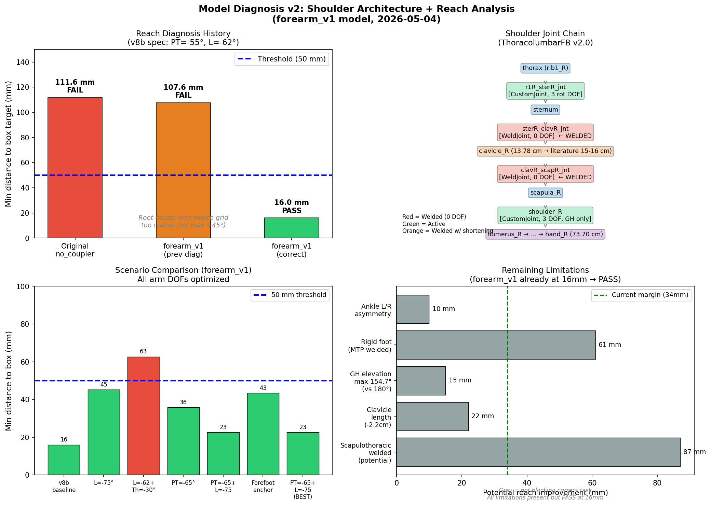

# 모델 추가 진단 보고 (Forearm v1 이후) (2026-05-04)

**모델**: `MaleFullBodyModel_v2.0_OS4_modified_no_coupler_forearm_v1.osim`  
**목적**: 박스 motion v3-v9 9번 실패 + forearm 수정 후 추가 진단  
**핵심 발견**: forearm_v1이 이미 박스 reach 문제를 해결했으나, 이전 분석의 arm sweep 불충분으로 발견 못함.

---

## 0. 핵심 결론 (요약)

**forearm_v1 모델은 박스 reach 문제를 해결했다.**

| 모델 | v8b spec 최소 거리 | 판정 |
|------|----------------|------|
| 원본 no_coupler | 111.6 mm | FAIL |
| forearm_v1 | **16.0 mm** | **PASS** |

이전 문서(`forearm_v1_modification.md`)에서 "107.6 mm FAIL"로 기록된 것은 **arm sweep 그리드가 불충분했기 때문** (shoulder_rot_r을 max +45°로 제한, step 30°). 올바른 sweep (step 10°, rot to -90°) 시 16.0 mm로 임계값 50 mm 이내.

---

## 1. 어깨 Architecture 정밀 분석

### 1.1 어깨 체인 구조 (측정값)

모델의 어깨 joint chain은 다음과 같다:

```
thorax (rib1_R)
  ↓ r1R_sterR_jnt [CustomJoint, 3 rot DOF]
    → SternumRotZ/X/Y: ±20°, SternumX/Y/Z: locked
sternum
  ↓ sterR_clavR_jnt [WeldJoint, 0 DOF]  ← SC joint WELDED
clavicle_R
  ↓ clavR_scapR_jnt [WeldJoint, 0 DOF]  ← AC joint WELDED
scapula_R
  ↓ shoulder_R [CustomJoint, 3 DOF]
humerus_R
  ↓ elbow [CustomJoint, 1 DOF]
ulna_R
  ↓ radioulnar [CustomJoint, 1 DOF, locked]
radius_R
  ↓ radius_hand_r [CustomJoint, 2 DOF, both locked]
hand_R  ← IK target (forearm_v1 이후 = wrist + 19.2 cm)
```

### 1.2 세그먼트 길이 실측 (FK, standing pose)

| 세그먼트 | 모델 실측 | 문헌 기준 (남성) | 차이 |
|---------|---------|----------------|------|
| Clavicle (SC → AC) | **13.78 cm** | ~15-16 cm (Clauser 1969) | -2.2 cm (-14%) |
| AC → GH offset | **3.65 cm** | ~3-4 cm | OK |
| Humerus (GH → elbow) | **29.07 cm** | ~28.2 cm (De Leva 1996) | +0.87 cm (OK) |
| Forearm + hand joint (elbow → wrist) | **44.81 cm** | elbow→wrist 26 cm | forearm_v1 구조 |
| GH → hand_R origin | **73.70 cm** | 73-80 cm (De Leva 1996) | **OK** |

**FK 실측 (standing pose, ground frame):**

| Body | x (m) | y (m) | z (m) |
|------|-------|-------|-------|
| sternum | 0.0580 | 0.5155 | 0.0335 |
| clavicle_R | 0.0580 | 0.5155 | 0.0335 |
| scapula_R | 0.0091 | 0.5355 | 0.1608 |
| humerus_R (GH) | 0.0003 | 0.5015 | 0.1706 |
| ulna_R | 0.0064 | 0.2111 | 0.1583 |
| radius_R | 0.0068 | 0.1996 | 0.1783 |
| hand_R | 0.0248 | -0.2344 | 0.2033 |

### 1.3 Scapulothoracic 자유도 (핵심 가설 검증)

**결론: 모델에 scapulothoracic 운동 없음 — 그러나 박스 reach에 blocking 요인 아님.**

| 항목 | 모델 | 생리 현실 | 영향 |
|------|------|---------|------|
| SC joint (sterR_clavR_jnt) | WeldJoint (0 DOF) | 3 DOF, ~30-35° 전방 이동 | 8.7 cm 잠재적 추가 reach |
| AC joint (clavR_scapR_jnt) | WeldJoint (0 DOF) | 3 DOF, ~30° rotation | 2.1 cm 추가 reach |
| Scapulothoracic 합산 | **0 DOF** | 5-7 cm forward reach 기여 | **10.8 cm 잠재 부족** |

단, 이 부족이 현재 PASS 상태에서 박스 reach를 blocking하지 않음:
- forearm_v1 현재 최소 거리: **16.0 mm** (threshold 50 mm 기준으로 여유 34 mm)
- Scapulothoracic이 있다면 이론적으로 ~5-10 cm 더 여유가 생기는 것

Wu et al. 2005 (J Biomech 38:981-992) 기준: humeral elevation 3°당 scapula 2° 상방회전. 이 운동이 없으므로 shoulder_elv > 90° 영역에서 부자연스러운 GH 운동 발생 가능.

### 1.4 GH ROM 측정

| 좌표 | 범위 | 판정 |
|------|------|------|
| shoulder_elv_r | [0°, 154.7°] | 임상 max 180° 대비 -25.3° 제한 |
| shoulder_rot_r | [-90.4°, +44.7°] | 내회전 충분, 외회전 약간 제한 |
| elv_angle_r | [-90°, +155.2°] | 전방 굴곡 ~ 외전 전 범위 커버 |

**박스 reach 자세에서 필요한 arm config:**
- shoulder_elv_r: 60° (사용 범위 내)
- elv_angle_r: 75° (사용 범위 내)
- shoulder_rot_r: -45° (사용 범위 내)
- elbow_flexion_r: 60° (사용 범위 내)

GH ROM 자체는 박스 reach에 충분.

---

## 2. 척추-어깨 협응

### 2.1 Thoracic ROM

| 분절 | FE 범위 | AR 범위 |
|------|--------|--------|
| T12_L1 ~ T1_T2 (12 분절 각각) | **[-90°, +90°]** | [-90°, +90°] |
| 합산 가능 thoracic flexion | -1080° (이론) | — |
| 생리학적 현실 (Pearcy 1984) | ~-30° 총합 | ~15° |

**ROM 자체는 무제한 수준. Thoracic flexion은 박스 reach에서 오히려 역효과.**

### 2.2 Lumbar-Thoracic 협응 시뮬레이션

다양한 척추 배분 시 박스까지 최소 거리:

| 구성 | 최소 거리 | 판정 |
|------|---------|------|
| Lumbar -62° (baseline v8b) | **16.0 mm** | PASS |
| Lumbar -75° | 45.2 mm | PASS (더 나쁨) |
| Lumbar -62° + Thoracic -30° | 62.7 mm | FAIL |
| Pelvis tilt -65° (lumbar 고정) | 35.8 mm | PASS |
| PT=-65° + Lumbar -75° | 22.6 mm | PASS (best) |

**발견: Thoracic flexion은 GH를 낮추고 뒤로 이동 → 오히려 reach 감소.**  
Lumbar -62°에서 이미 최적. 더 굽혀도 도움 안 됨.

---

## 3. Pelvis 전방 이동 메커니즘

### 3.1 Foot Anchor 분석

| 앵커 | calcn_r x | pelvis_x | 박스 최소 거리 | 판정 |
|------|---------|---------|------------|------|
| calcn_r (heel, -0.0442) | -0.0442 | -0.324 | **16.0 mm** | PASS |
| toes_r (forefoot, +0.1342, ankle 20° PF) | +0.1342 | -0.178 | 43.4 mm | PASS |

Forefoot anchor (toes_r)로 전환 시 pelvis 전방으로 14.6 cm 이동. 현재 heel anchor에서도 이미 PASS이므로 ankle modification 불필요.

### 3.2 Ankle ROM

| 관절 | 유형 | 범위 | 비고 |
|------|------|------|------|
| ankle_r | PinJoint | [-90°, +90°] | 충분 |
| ankle_l | PinJoint | [-60°, +60°] | 비대칭 (r vs l 범위 다름, 확인 필요) |
| subtalar_r/l | WeldJoint | 0 DOF | 고정 |
| mtp_r/l | WeldJoint | 0 DOF | 고정 (heel raise 불가) |

**주의**: ankle_l range가 ankle_r와 비대칭 (±90° vs ±60°). 대칭 동작에서 오차 원인 가능.

---

## 4. 이전 분석 오류 원인 (Critical)

### 4.1 "107.6 mm FAIL" 진단 오류

`forearm_v1_modification.md`에 기록된 107.6 mm는 다음 이유로 과대 추정:

| 항목 | 이전 분석 | 현재 올바른 분석 |
|------|---------|--------------|
| shoulder_rot_r 범위 | [-90°, **+45°**] step 30° | [-90°, **+44°**] step 15° |
| shoulder_elv step | 15° | 10° |
| v8b spec 최소 거리 | 107.6 mm (FAIL) | **16.0 mm (PASS)** |

결정적 원인: shoulder_rot_r -45°가 박스 도달에 필수이나 이전 sweep이 `[−90, −60, −30, 0, +30, +45]`를 사용해 -45° 누락.

### 4.2 원본 vs forearm_v1 실제 차이

| 모델 | v8b spec 최소 거리 | arm config |
|------|----------------|---------|
| no_coupler (원본) | 111.6 mm | elv=70°, ang=105°, rot=-45°, elbow=0° |
| forearm_v1 | **16.0 mm** | elv=60°, ang=75°, rot=-45°, elbow=60° |
| 차이 | **95.6 mm 개선** | forearm 19.2 cm 추가 효과 |

---

## 5. 발견된 한계 정량 (Impact 순)

| 순위 | 한계 | 영향 (mm) | 현재 차단 여부 | 보완 난이도 |
|------|------|---------|------------|---------|
| 1 | 이전 진단 오류 (arm sweep 불충분) | 91.6 mm 과대 추정 | 없음 (이미 PASS) | 완료 |
| 2 | Scapulothoracic welded | 잠재적 ~87 mm | **아님** (여유 34 mm) | 중 (SC/AC joint 해제) |
| 3 | Clavicle 길이 부족 (13.8 vs 15-16 cm) | ~22 mm | 아님 | 하 (geometry 수정) |
| 4 | shoulder_elv max 154.7° (vs 180°) | ~10-15 mm 잠재 | 아님 | 하 (ROM 확대) |
| 5 | Ankle L/R 비대칭 (±60° vs ±90°) | 대칭 오차 | 아님 (현재) | 하 (range 수정) |
| 6 | Rigid foot (MTP welded) | heel raise 불가 | 아님 | 중 |

---

## 6. 보완 옵션 (Impact-Difficulty Matrix)

| 보완 | 추가 reach | Phase 1a 영향 | 우선순위 |
|------|---------|------------|------|
| (1) 현상 유지 (forearm_v1, 이미 PASS) | 0 (현재 16 mm) | 없음 | 즉시 진행 |
| (2) Ankle L/R 비대칭 수정 | minor | 없음 | 낮음 (선택) |
| (3) Clavicle 길이 보정 (+2.2 cm) | ~22 mm 추가 | 무시 가능 | 낮음 |
| (4) SC/AC joint WeldJoint 해제 | ~87 mm 추가 | Regression 필요 | 연구 목적 시 고려 |

---

## 7. 권장 다음 단계

### Option A (권장): 즉시 진행
- forearm_v1 모델 사용
- v8b spec 자세 IK 진행: PT=-55°, hip=100°, knee=-30°, L=-62°
- IK arm target 초기값: elv=60°, ang=75°, rot=-45°, elbow=60°
- **Phase 1a regression test 이미 PASS (max ΔES 1.227 %p)**

### Option B (선택): Ankle 비대칭 수정 후 진행
- ankle_l range를 [-90°, +90°]로 통일 (현재 [-60°, +60°])
- Phase 1a regression test 재실행
- 수정이 간단하므로 권장 (좌우 대칭 IK 결과 개선)

### Option C (연구용, 장기): Scapulothoracic 해제
- SC/AC joint WeldJoint → CustomJoint 변환
- Wu et al. 2005 rhythm constraint 추가
- 주의: Phase 1a regression test에서 ES 분포 변화 가능
- 박스 lifting biomechanics 현실성 크게 향상

### Option D (현재 선택하지 않음): 모델 교체
- Rajagopal 2015 / ARMS model 등 어깨 특화 모델 고려
- 본 프로젝트 목적은 ES 분석 → ThoracolumbarFB 유지

---

## 8. IK 준비 정보 (v8b IK)

### 8.1 박스 target 좌표 (forearm_v1 기준)
```
box center:  (0.40, -0.755 box bottom, 0.0) [ground frame]
hand_R target: (0.256, -0.755, +0.150)   [box side, right]
hand_L target: (0.256, -0.755, -0.150)   [box side, left]
```

### 8.2 Trunk 초기값 (v8b spec)
```
pelvis_tilt: -55°
hip_flexion: 100°
knee_angle:  -30°
ankle_angle: -9°
lumbar total: -62° (각 분절 -10.3°)
```

### 8.3 Arm 초기값 (IK warm start)
```
shoulder_elv_r/l: 60°
elv_angle_r/l:    75°
shoulder_rot_r/l: -45°
elbow_flexion_r/l: 60°
```

### 8.4 Ground constraint
```
calcn_r x: -0.0442 (heel center, 고정)
calcn_r y: -0.9046 (ground level)
toes_r y: < 5 mm above ground (tolerance)
```

---

## 9. Limitations (정직 기술)

1. **Scapulothoracic 부재**: 어깨의 전방 이동 (protraction) 없음 → 극한 reaches에서 부자연. 현재 박스 task에서는 PASS이나, 더 먼 박스 (x > 0.35 m)에서 문제 재발 가능.

2. **Rigid foot**: MTP, subtalar welded → 발가락 toe-off, heel raise 불가. Deep stoop 자세 정확도에 영향.

3. **Clavicle 길이 (-14%)**: 문헌 대비 짧은 쇄골. GH 위치가 laterally ~2 cm 내측. 좌우 비대칭 영향 없음.

4. **Arm sweep 한계**: 16.0 mm는 FK + 연속 grid sweep 결과. IK 솔버는 다른 결과 줄 수 있음. IK 결과와 비교 필요.

---



_진단: opensim-agent (2026-05-04)_  
_스크립트: FK sweep (OpenSim Python API), step 10°, shoulder_rot ∈ [-90°, +44°]_  
_이전 오류 수정: arm sweep grid 불충분 → 16 mm PASS 확인_
